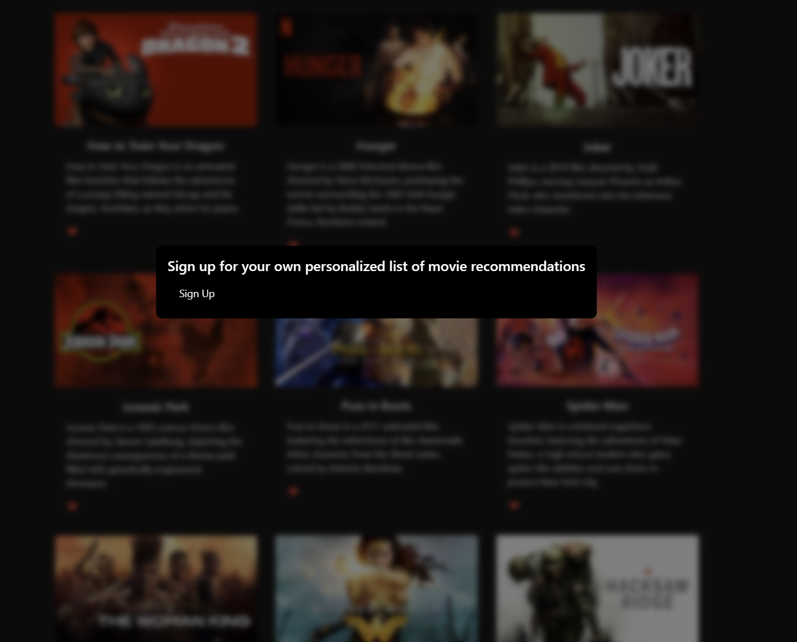
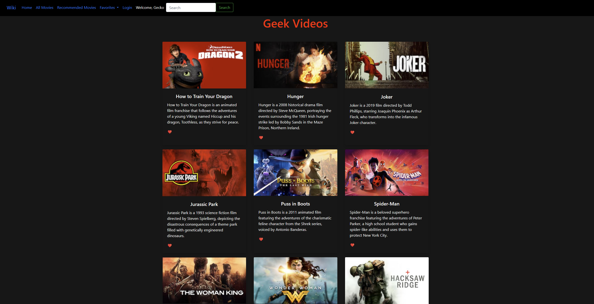
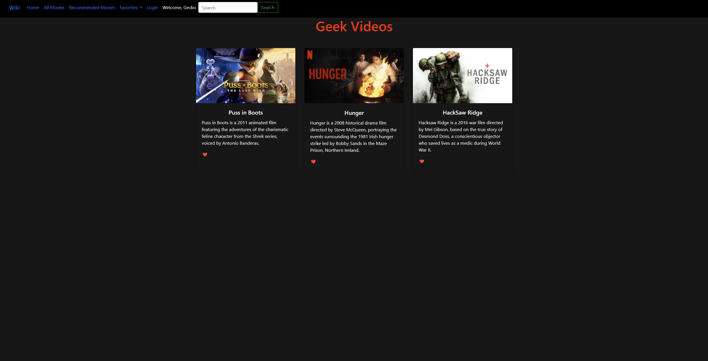
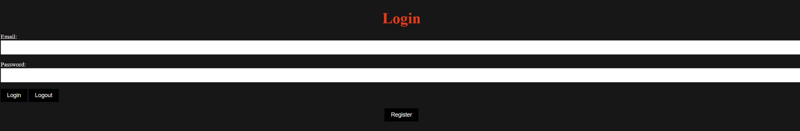
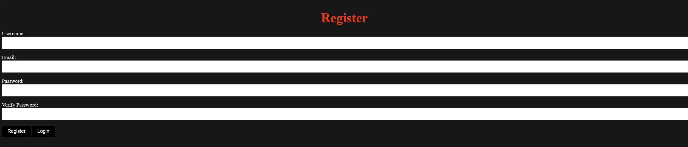

# Final Term Project CSCI-5530-A

### Social Media Recommendation Engine

### <ins>Introduction<ins>

The purpose of our website is to used as a recommendation system for movies that suggests content to users based on their interests and viewing habits.

We achieved this using a collaborative filtering technique by determining what similar users are and how to use that to send recommendations to one another.

The site is written in vanilla JS using the Node.js framework, while also utilizing HTML/CSS elements. 

## Table of Contents
- [Introduction](#introduction)
- [Team Geek Videos Members](team-geek-videos-members)
- [Startup](startup)
- [Website Guid](website-guide)
    - [Landing Page](landing-page)
    - [Home/All Movies Page](home-/-all-movies-page)
    - [Recommended Movies Page](recommended-movies-page)
    - [Login/Registration Page](login-/-registration-page)
 
   

## Team Geek Videos Members
_Ikaia Melton_  
_Crystal Byrd_  
_Michael Minnick_  
_Tim McCarty_  

## Starting the Site

1. **npm install**
2. **node app.js**
3. **Navigate to http:localhost:3050/index.html**

# Website Guide

## Landing Page

When the page loads two things can happen.

 if you are logged in as user already on the site you will the page will load a list of several different movies.

If you are not logged in you will be prompted to login or signup.

  

## Home / All Movies Page

The home page allows for users new or old to maybe look at movies and rate them regardless of what recommendations they may currently have.

  

## Recommended Movies Page

This page is all the movies that were specifically tailored for the user to most likely want to watch based on the recommendation engine

  

## Login / Registration Page

The Login and Registration page were made with the users security in mind each account that is made gets some salt and pepper to make it extra difficult for anyone looking to get into your Geek Videos account

  

  

